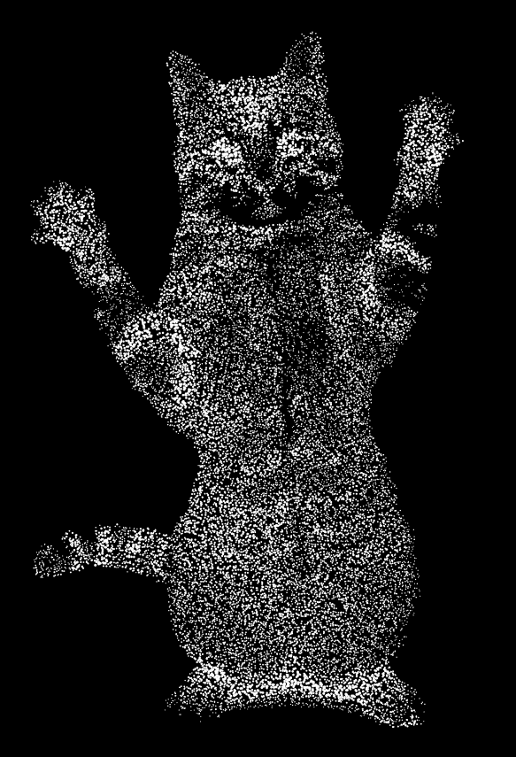

#Image Particlizer
Constructs an interactive particle system with simple physics from an image.

#####This demo arranges an interacive system of particles positioned at certain pixels of an image that meet a criteria (e.g. black pixels)
##### ONLY WORKS ON FIREFOX!!

